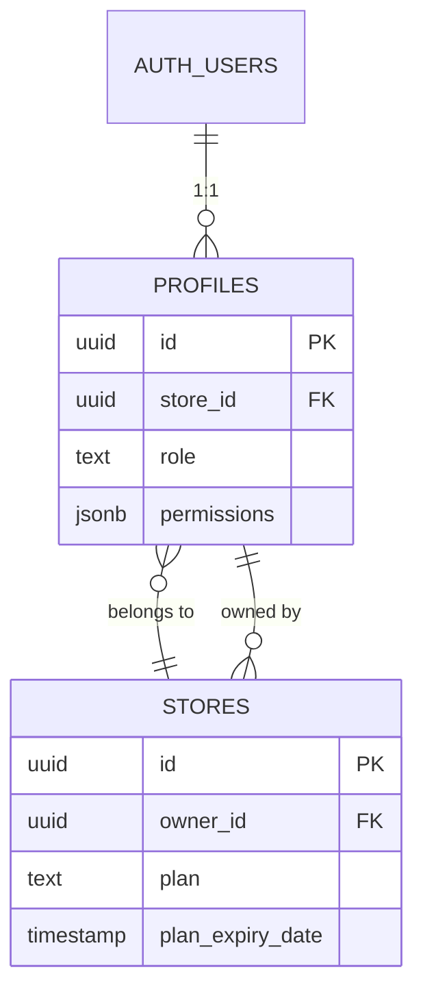
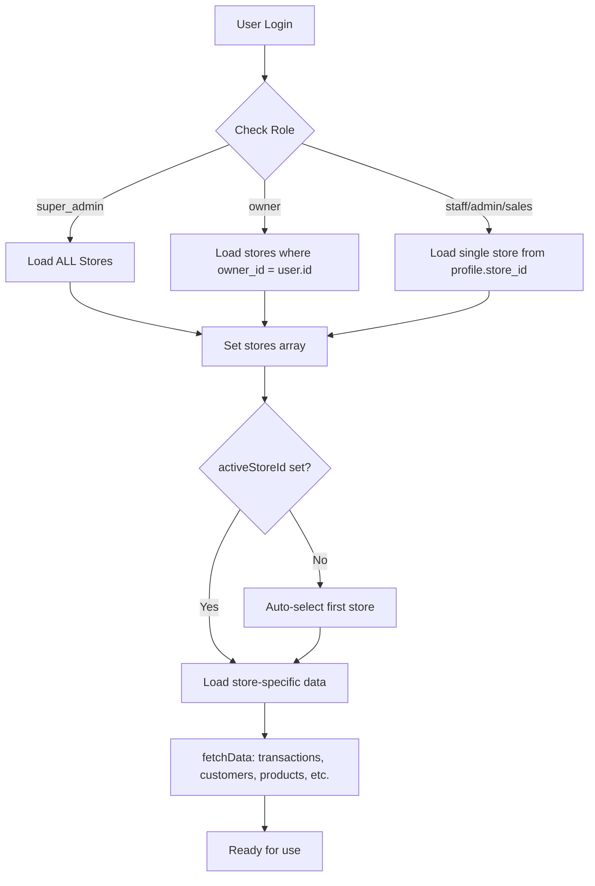

# Analisis Dampak Implementasi Multi-User

## Ringkasan Eksekutif

Setelah melakukan analisis mendalam terhadap codebase, implementasi **Multi-User** pada KULA POS sudah cukup matang dan terintegrasi dengan baik. Berikut adalah temuan dan potensi dampak ke flow lain.

---

## Arsitektur Multi-User Saat Ini

### 1. Model Data Utama



### 2. Hierarki Role

| Role | Deskripsi | Akses |
|------|-----------|-------|
| `super_admin` | Administrator sistem | Semua toko, semua fitur |
| `owner` | Pemilik toko | Semua toko miliknya |
| `admin` | Manager toko | 1 toko, manage staff |
| `sales` | Marketing | 1 toko, limited access |
| `staff` | Kasir | 1 toko, POS only |

### 3. Subscription Per-Owner

Plan (`free`, `pro`, `enterprise`) sekarang terikat pada **Owner** bukan Store:
- Limit toko dihitung per owner (`stores.filter(s => s.owner_id === user.id)`)
- Plan check menggunakan `profiles.plan` atau `stores.owner.plan`

---

## Dampak ke Flow Lain

### ✅ **Flow yang Sudah Kompatibel**

| Flow | File | Status | Catatan |
|------|------|--------|---------|
| **Login/Logout** | `AuthContext.jsx` | ✅ OK | Menggunakan `profiles.store_id` untuk staff |
| **Store Switching** | `DataContext.jsx`, `Sidebar.jsx` | ✅ OK | Owner/SuperAdmin bisa switch, staff terikat 1 toko |
| **POS Transaction** | `POS.jsx`, `DataContext.processSale()` | ✅ OK | Menggunakan `activeStoreId` dari context |
| **Products** | `Products.jsx` | ✅ OK | Filter by `store_id`, bulk copy check `owner_id` |
| **Dashboard** | `Dashboard.jsx` | ✅ OK | Stats per `activeStoreId` |
| **Owner Dashboard** | `OwnerDashboard.jsx` | ✅ OK | Aggregasi semua toko owner via RPC |
| **Staff Management** | `Staff.jsx` | ✅ OK | Query by `store_id`, role-based permissions |
| **Subscription Approval** | `SubscriptionApproval.jsx` | ✅ OK | Menggunakan join `profiles!stores_owner_id_fkey` |

---

### ⚠️ **Flow yang Perlu Diperhatikan**

#### 1. **Shared Customers** (Potensi Issue)

```javascript
// DataContext.jsx line 592-613
(currentStore?.settings?.enableSharedCustomers && user?.role === 'owner')
    ? safeSupabaseRpc({ rpcName: 'get_shared_customers', params: { p_owner_id: user.id } })
    : safeFetchSupabase({ tableName: 'customers', ... })
```

> [!WARNING]
> Jika staff di toko A menambah customer, customer ini **TIDAK** akan otomatis muncul di toko B milik owner yang sama kecuali `enableSharedCustomers` aktif DAN user adalah owner.

**Rekomendasi**: Pastikan setting `enableSharedCustomers` didokumentasikan dengan jelas ke user.

---

#### 2. **Report Aggregation untuk Multi-Store Owner**

Beberapa report masih menggunakan `activeStoreId` satu-satu:

| Report | Status | Perlu Aggregasi? |
|--------|--------|------------------|
| [ProfitLoss.jsx](file:///Users/kamal/.gemini/antigravity/scratch/kasir-pro-supabase/src/pages/reports/ProfitLoss.jsx) | Per-store | ❓ Mungkin perlu mode "All Stores" |
| [ShiftReport.jsx](file:///Users/kamal/.gemini/antigravity/scratch/kasir-pro-supabase/src/pages/reports/ShiftReport.jsx) | Per-store | ❓ Mungkin perlu mode "All Stores" |
| [TopSellingProducts.jsx](file:///Users/kamal/.gemini/antigravity/scratch/kasir-pro-supabase/src/pages/reports/TopSellingProducts.jsx) | Per-store | ❓ Bisa berguna untuk perbandingan |

> [!NOTE]
> Owner Dashboard sudah punya aggregasi via RPC (`get_owner_financial_summary`, `get_owner_daily_sales`). Report lain bisa mengikuti pattern yang sama jika dibutuhkan.

---

#### 3. **Real-time Subscription Filter**

```javascript
// DataContext.jsx line 904
filter: user.role !== 'super_admin' && activeStoreId ? `id=eq.${activeStoreId}` : undefined
```

> [!IMPORTANT]
> Untuk owner dengan banyak toko, real-time update hanya untuk `activeStoreId`. Jika toko lain di-update, owner tidak akan menerima notifikasi sampai switch ke toko tersebut.

---

#### 4. **Plan Limit Enforcement**

```javascript
// DataContext.jsx line 137-150
if (user?.role !== 'super_admin') {
    const ownerStores = stores.filter(s => s.owner_id === user?.id);
    const maxStores = plans[userPlan]?.maxStores || 1;
    if (ownerStores.length >= maxStores) {
        return { error: `Limit toko tercapai (${ownerStores.length}/${maxStores})...` };
    }
}
```

**Status**: ✅ Sudah benar - limit dihitung per owner, bukan global.

---

#### 5. **RLS (Row Level Security) Policies**

```sql
-- supabase_schema.sql
CREATE POLICY multitenant_stores_policy ON stores
FOR ALL USING (
    owner_id = auth.uid() OR 
    id = get_my_store_id()
);
```

> [!CAUTION]
> RLS policy mengizinkan akses jika:
> 1. User adalah owner (`owner_id = auth.uid()`)
> 2. ATAU store adalah store user (`id = get_my_store_id()`)
>
> Ini berarti staff bisa akses 1 toko, owner bisa akses semua toko miliknya. **SuperAdmin bypass ini via service role key** (asumsi di server/Edge Function).

---

## Alur Data Multi-User



---

## Potensi Bug / Edge Cases

### 1. **Orphaned Staff Account**

Jika staff di-assign ke toko yang kemudian dihapus, `profile.store_id` akan menunjuk ke UUID yang tidak ada.

**Current Handling**: `ON DELETE SET NULL` di FK

**Risk**: Staff bisa login tapi tidak punya akses ke toko manapun → stuck di loading.

---

### 2. **Owner Transfer (Belum Diimplementasi)**

Tidak ada fitur untuk mentransfer kepemilikan toko dari satu owner ke owner lain.

**Workaround**: SuperAdmin bisa update `stores.owner_id` langsung via database.

---

### 3. **Multi-Device Login untuk Staff**

Staff bisa login di beberapa device. Shift tracking menggunakan `cashier_id` dan `store_id`.

**Potential Issue**: Jika staff buka shift di device A, lalu login di device B, bisa terjadi duplikasi shift.

**Current Handling**: Tidak ada explicit lock - perlu review lebih lanjut.

---

## Kesimpulan

| Aspek | Status | Prioritas |
|-------|--------|-----------|
| Model data multi-tenant | ✅ Solid | - |
| Role-based access control | ✅ Lengkap | - |
| Per-owner subscription | ✅ Terimplementasi | - |
| Shared customers | ⚠️ Terbatas | Low |
| Multi-store reports | ⚠️ Per-store only | Medium |
| Real-time multi-store | ⚠️ Single store | Low |
| Edge cases (orphan, transfer) | ❌ Belum dihandle | Low |

---

## Rekomendasi

1. **Short-term**: Tidak ada blocking issue. Multi-user sudah berjalan dengan baik.

2. **Medium-term**: 
   - Tambahkan mode "All Stores" untuk report-report utama (ProfitLoss, Shift, TopSelling)
   - Dokumentasikan behavior shared customers

3. **Long-term**:
   - Implementasi ownership transfer feature
   - Audit logging untuk perubahan role/permission
   - Multi-device session management untuk staff
